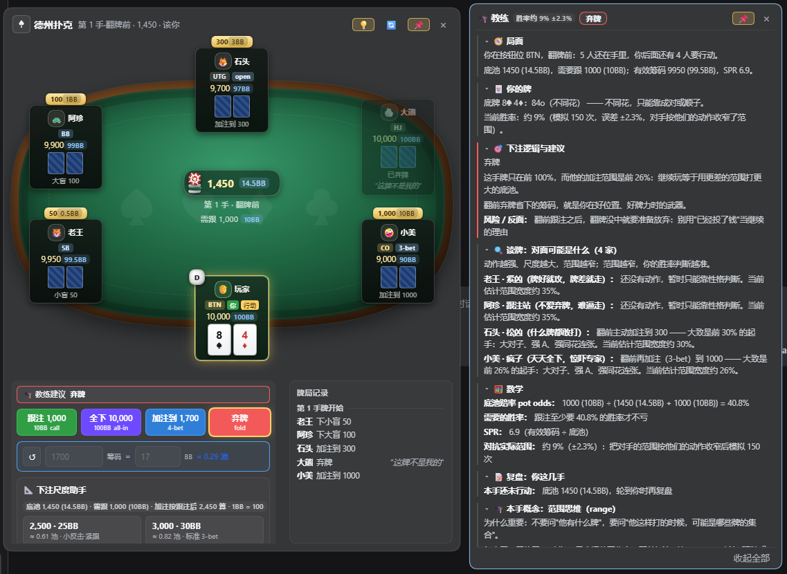

# dsh-plugin-poker

> **DeepSeek Harness 的德州扑克插件：无限注规则、机器人对手、真实感牌桌，教练模式讲解打法与赔率。**
>
> Texas Hold'em table for DeepSeek Harness: model-callable poker tools, six heuristic opponents, an optional coach, and a browser table whose buttons never post a chat message.



*浏览器牌桌面板（左：绒面牌桌、行动按钮与下注尺度助手；右：教练窗口的实时推理）。*

[DeepSeek Harness](https://github.com/deepseek-ai/deepseek-harness) 的无限注德州扑克插件，一个包提供两半：

- **宿主半**：确定性德州引擎 + 6 个模型可调用工具（开桌 / 行动 / 看牌 / 下一手 / 机器人决策 / 胜率）。
- **浏览器半**：Web GUI 把每次工具调用渲染成可视化牌桌卡片，另有侧栏常驻面板——所有按钮直连宿主路由，**从不往对话里发消息**。

你在对话里用自然语言出牌（"跟注""加注到 400""弃牌"），模型调用工具推进牌局；也可以直接点面板按钮，牌桌状态由引擎维护。

## 特性

- **完整规则实现**：最小加注、不足额全下不重开行动轮、边池分层与合并、未获跟注退款、所有人全下自动发完摊牌；7 选 5 牌力评估；整局可从日志复现（状态内 PRNG）。
- **六种性格对手**：岩石 / 紧凶 / 松凶 / 跟注站 / 疯子 / 老练，翻前按位置与价格定范围，翻后按牌面与赔率下注，并会根据桌上其他人的实际倾向动态调整自己。
- **AI 对手**：把若干座位交给任意 OpenAI 兼容接口（`/v1/chat/completions`）出牌；超时或返回不合法动作时自动退回内置策略，API Key 只存宿主、绝不回传页面。
- **可选教练层**：局面、读牌、底池赔率、MDF、SPR、复盘与概念卡，数字是实时算出来的；一键整层关闭。
- **2–9 人桌**，所有金额附 BB 换算；下注尺度助手给出 1/3–1 池的标准尺度与牌面判读。
- **零运行时依赖、零构建步骤**，`npm test` 自带 6 个套件 1060+ 条断言。

## 安装

```bash
dsh plugin --profile web add dsh-plugin-poker     # 从 npm
dsh plugin --profile web add link:<本仓库路径>    # 或从本地目录
```

安装后**重启 `dsh web` 并刷新一次页面**（客户端 boot graph 烧在页面 HTML 里）。

开发期也可以手工把一行插入 profile 的 `cordis.patch.yml`（免重启热组合）：

```yaml
- insert:
    - id: poker
      name: 'dsh-plugin-poker'
```

两种方式只能选一种，同时使用会加载两次并在工具名上冲突。

## 快速开始

> 开一桌德州扑克，3 个机器人，起始筹码 5000，盲注 25/50

之后自然语言出牌即可："跟注"、"加注到 600"、"我现在胜率多少？"、"让机器人认真想想再打"。
侧栏页脚点 **♠ 牌桌** 打开浮动面板：绒面牌桌、座位卡、底池筹码、行动按钮与牌局记录都在里面，可拖动、可固定。
牌没开时面板直接给人数选择器（2–9 人）与"开一桌"按钮。

## 工具

| 工具 | 作用 |
|---|---|
| `poker_new_table` | 开桌并发第一手牌。可选机器人数（1–8，默认 5 = 六人桌）、性格、筹码、盲注、随机种子。 |
| `poker_action` | 执行动作：`fold` / `check` / `call` / `bet` / `raise` / `allin`。`amount` 是"加注到"的本轮总额。 |
| `poker_next_hand` | 当前手结束后发下一手。 |
| `poker_table` | 读取当前牌桌状态与最近记录。`reveal: true` 仅供调试（显示全部底牌）。 |
| `poker_opponent` | 切换机器人脑袋（`auto` 内置策略 / `model` 模型逐手决策），或为等待中的机器人提交动作。 |
| `poker_equity` | 蒙特卡罗估算某席胜率（默认 1500 次）。 |

## 对手

**内置策略**：性格只调松紧、激进度与诈唬率，底层规则相同——翻前按"身后还有几人待行动"查开池范围；面对加注按"价格 + 位置"决定继续范围（压上筹码的加注只跟真货）；翻后比较牌力与底池赔率而不是固定门槛；下注尺度跟牌面走（干燥面小注、湿润面保护），也跟对手走（对跟注站停止诈唬）。每个座位都在数别人实际怎么做，并据此微调自己（幅度有界，性格始终认得出来）。实测 3000 手六人桌：白送大盲从 23% 降到 10%，跟全下的范围收成真正的强牌。

**AI 对手**：设置页（`设置 → 德州扑克`）填 Base URL / API Key / 模型后，前 N 个座位由该接口出牌。接口只许回一个 JSON 动作；超时（默认 8 秒）、离线或胡说八道都退回内置策略，牌局不中断。密钥存在宿主用户设置里，`GET /poker/settings` 只回是否已保存、不回传密钥。

## 教练

独立的可拖动窗口，七个板块：🧭 局面、🃏 你的牌、🎯 下注逻辑与建议、🔍 读牌、🧮 数学、📝 复盘、🎓 本手概念。
建议带具体牌型、位置与人数（"弃牌：A6o 在 UTG 太弱（后面还有 5 人）"），动作按钮上方重复同一句话并高亮对应按钮；
读牌是量化的——范围宽度由位置、动作与尺度推出，胜率对抗收窄后的范围用蒙特卡罗算出，带 ±误差。
教练只看公开信息，**不读对手底牌**（有测试断言守着）。`💡` 一键整层关闭。

## 设置

**设置 → 德州扑克**（注册在 `settings.section` 的独立一页），四组：
| 分组 | 内容 |
|---|---|
| 常规 | **启用插件**（关掉即隐藏侧栏入口与牌桌卡片；工具照常可用，不会把进行中的对话搞断）、**教练层**、**建议徽章**、**牌局记录** |
| 新牌桌默认值 | 机器人数、对手性格、起始筹码、大小盲 —— 只在调用方没自己传时生效，模型调工具时仍以它传的参数为准 |
| 面板与回放 | **回放节奏**（0.5× / 标准 / 2×，整条时间轴一起缩）、页面加载时自动展开 |
| AI 对手 | 启用、席位数、Base URL、API Key、模型、温度、超时、JSON 模式、最大回复长度 |

- **测试连通**：填完模型后点一下，就用**屏幕上当前的值**（含还没保存的 Key）发一次最小请求，回你三种结果之一——`✅ 连通：382ms · 模型 · 回复"pong"`、`❌ 失败：HTTP 401 · invalid api key`、`❌ 失败：超时（8000ms）`。测试不落库、不改设置。
- **密钥只进不出**：Key 写进宿主的用户设置文档；`GET /poker/settings` 只回 `hasApiKey: true/false`，页面把它渲染成密码框（已保存时显示占位点）。
- **页面自绘**：`GET /poker/settings` 除了值，还回一份**字段描述**（分组、控件类型、上下限、选项、帮助文字），设置页照描述画控件 —— 以后加设置只改 `lib/settings.js` 一处，前端一行都不用动。页面标题用的是**和侧栏入口同一枚手绘黑桃**（设置列表本身没有 per-plugin 图标位，所以标记画在模块内部）。
- **保存即生效**：插件开关、教练层立刻生效；AI 席位数会平移到当前这张牌桌（不用重开）；面板级的开关（记录、徽章、节奏）刷新页面后生效。

## 浏览器牌桌

- **两个表面**：对话内的牌桌卡片（每次工具调用替换成当时局面）+ 侧栏页脚的常驻浮动面板（带实时摘要，跨会话保留位置与状态）。
- **直连宿主**：按钮点击走 `POST /poker/action` 等同源路由，规则拒绝只在面板上显示红色告示，一个字不进对话；路由不可用时才退回对话。
- **过程回放**：机器人行动按真实节奏一拍一拍放（含落牌动画与行动进度），弃牌后仍能看到整手打完。
- **细节**：金额全部带 BB 药丸（筹码/BB 双向联动输入）；尺度助手按底池与翻前 BB 两种口径给标准尺度；庄家按钮、成牌名、台词、结算徽章齐全；浅色/深色主题都能读。

## 架构

```
lib/
  cards.js      # 牌、种子 PRNG、洗牌
  evaluator.js  # 牌力评估与牌型名
  engine.js     # 牌局状态机（下注轮、边池、摊牌）
  bots.js       # 内置策略对手 + 蒙特卡罗胜率
  render.js     # 模型可读的牌桌文本
  ai.js         # AI 对手（OpenAI 兼容接口、失败回退）
  settings.js   # 全部设置：schema + 分组描述（设置页据此自绘）+ 掩码
  coach.js      # 教练（可关）
  impl.js       # 工具实现层（可热重载）
  index.js      # 入口：6 个工具、/poker 路由、牌桌注册表
  client.js     # 浏览器半：牌桌卡片 + 侧栏面板
test/           # 6 个套件，见下
```

设计要点：引擎是唯一事实来源，工具只做翻译；牌桌状态按会话隔离（WeakMap）+ 一张全场共享的"当前牌桌"；`impl.js` 及其依赖改完即热重载（牌桌不丢，改坏了自动回退上一份可用代码），只有入口层和 patch 需要重启。

## 测试

```bash
npm test              # 全部六套，一次跑完（零依赖，不需要 npm install）
node test/run.mjs     # 引擎与不变量（含 2000-3000 手随机对局）
node test/host.mjs    # Host 契约（工具定义、教练 payload、不泄露底牌）
node test/client.mjs  # 客户端 bundle（无浏览器）
node test/coach.mjs   # 教练
node test/hot.mjs     # 热重载
node test/pack.mjs    # 打包契约（dsh.bundle、一行描述、许可证等）
```

每次 push 都会在 GitHub Actions 上跑（Node 20 / 22 矩阵）。

想把它列进 [awesome-dsh-plugin](https://github.com/awesome-dsh-plugin/awesome-dsh-plugin)？步骤与投稿条目见 [`SUBMISSION.md`](SUBMISSION.md)。变更记录见 [`CHANGELOG.md`](CHANGELOG.md)。

## License

MIT
